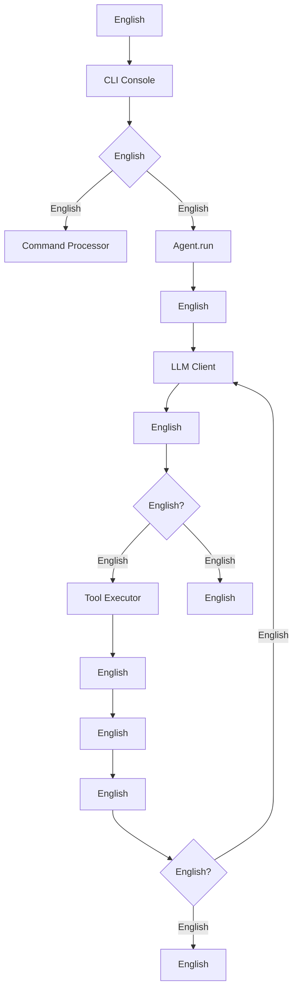
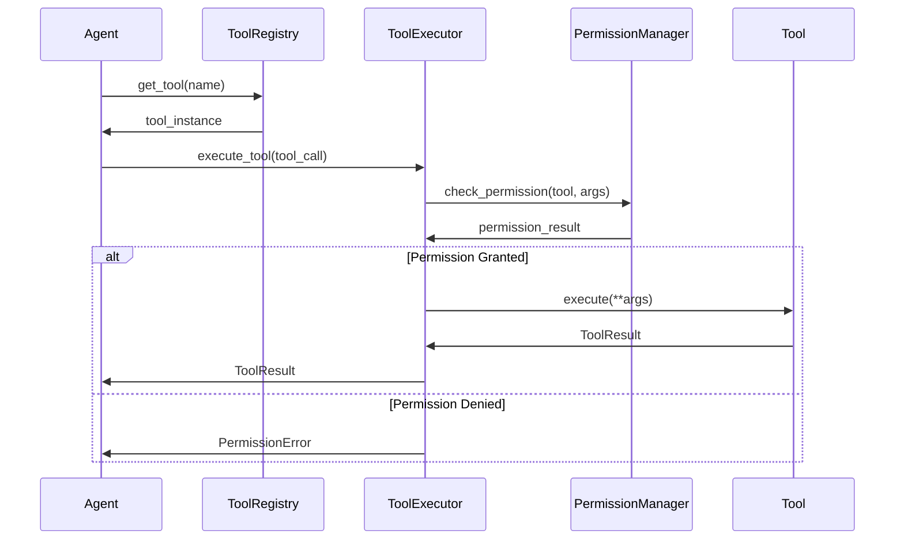

# Argus English

## English

Argus English Python English,English.English,English LLM English(English Qwen3-Coder),English Agent English.

### English
- 🤖 **English Agent English**: English Qwen, Claude Code, Research English Agent
- 🛠️ **English**: English, Shell English, English, English 15+ English
- 📊 **English**: English LLM English,English
- ⚙️ **English**: English, English, English
- 🔒 **English**: English
- 📈 **English**: English API English, English Token English

## English

### English

```
┌─────────────────────────────────────────────────────────────┐
│                    CLI Interface Layer                      │
│  ┌─────────────────┐  ┌─────────────────┐  ┌──────────────┐ │
│  │   CLI Console   │  │ Command Processor│  │Config Wizard │ │
│  └─────────────────┘  └─────────────────┘  └──────────────┘ │
└─────────────────────────────────────────────────────────────┘
                                │
┌─────────────────────────────────────────────────────────────┐
│                     Agent Layer                             │
│  ┌─────────────────┐  ┌─────────────────┐  ┌──────────────┐ │
│  │   Qwen Agent    │  │ Claude Agent    │  │Research Agent│ │
│  │                 │  │                 │  │              │ │
│  │ ┌─────────────┐ │  │ ┌─────────────┐ │  │ ┌──────────┐ │ │
│  │ │Loop Detector│ │  │ │Context Mgr  │ │  │ │Multi-step│ │ │
│  │ │Task Checker │ │  │ │Task Tools   │ │  │ │Research  │ │ │
│  │ └─────────────┘ │  │ └─────────────┘ │  │ └──────────┘ │ │
│  └─────────────────┘  └─────────────────┘  └──────────────┘ │
└─────────────────────────────────────────────────────────────┘
                                │
┌─────────────────────────────────────────────────────────────┐
│                      Core Layer                             │
│  ┌─────────────────┐  ┌─────────────────┐  ┌──────────────┐ │
│  │  Tool Registry  │  │  Tool Executor  │  │ LLM Client   │ │
│  │                 │  │                 │  │              │ │
│  │ ┌─────────────┐ │  │ ┌─────────────┐ │  │ ┌──────────┐ │ │
│  │ │Tool Factory │ │  │ │Permission   │ │  │ │Multi-LLM │ │ │
│  │ │Dynamic Load │ │  │ │Manager      │ │  │ │Support   │ │ │
│  │ └─────────────┘ │  │ └─────────────┘ │  │ └──────────┘ │ │
│  └─────────────────┘  └─────────────────┘  └──────────────┘ │
└─────────────────────────────────────────────────────────────┘
                                │
┌─────────────────────────────────────────────────────────────┐
│                     Tool Layer                              │
│  ┌─────────────────┐  ┌─────────────────┐  ┌──────────────┐ │
│  │   File Tools    │  │  System Tools   │  │  Web Tools   │ │
│  │                 │  │                 │  │              │ │
│  │ • read_file     │  │ • bash          │  │ • web_search │ │
│  │ • write_file    │  │ • ls            │  │ • web_fetch  │ │
│  │ • edit_file     │  │ • grep          │  │              │ │
│  │ • glob          │  │ • memory        │  │              │ │
│  └─────────────────┘  └─────────────────┘  └──────────────┘ │
└─────────────────────────────────────────────────────────────┘
                                │
┌─────────────────────────────────────────────────────────────┐
│                   Infrastructure Layer                      │
│  ┌─────────────────┐  ┌─────────────────┐  ┌──────────────┐ │
│  │ Config System   │  │ Memory System   │  │ Utils System │ │
│  │                 │  │                 │  │              │ │
│  │ • Multi-source  │  │ • Memory Monitor│  │ • Token Mgmt │ │
│  │ • Validation    │  │ • File Restorer │  │ • LLM Basics │ │
│  │ • Hot Reload    │  │ • Adaptive      │  │ • Content Gen│ │
│  └─────────────────┘  └─────────────────┘  └──────────────┘ │
└─────────────────────────────────────────────────────────────┘
```

## English

### 1. Agent English (`argus/agents/`)

Agent English Argus English,English,English Agent English `BaseAgent`.

#### BaseAgent English
```python
class BaseAgent(ABC):
    def __init__(self, config: Config, cli_console=None):
        self.llm_client = LLMClient(config.model_config)
        self.tool_registry = ToolRegistry()
        self.tool_executor = NonInteractiveToolExecutor(self.tool_registry)
        self.trajectory_recorder = TrajectoryRecorder()
```

**English:**
- English LLM English
- English
- English
- English

#### English Agent English

**1. QwenAgent (`agents/qwen/`)**
- **English**: English Qwen3-Coder English,English
- **English**:
  - `Turn`: English,English
  - `LoopDetectionService`: English
  - `TaskContinuationChecker`: English
  - `MemoryMonitor`: English

**2. ClaudeCodeAgent (`agents/claudecode/`)**
- **English**: English Claude Code English,English
- **English**:
  - `ContextManager`: English
  - **English**: `TaskTool`, `ArchitectTool`, `ThinkTool`, `TodoTool`
  - **English**: `ClaudeCodeToolAdapter` English `ToolAdapterFactory`

**3. GeminiResearchDemo (`agents/research/`)**
- **English**: English
- **English**: English → English → English → English → English

### 2. English (`argus/tools/`)

English,English `BaseTool`.

#### English
```python
class BaseTool(ABC):
    def __init__(self, name: str, description: str, parameter_schema: Dict[str, Any], 
                 risk_level: ToolRiskLevel = ToolRiskLevel.SAFE):
        self.risk_level = risk_level  # English
    
    @abstractmethod
    async def execute(self, **kwargs) -> ToolResult:
        pass
```

#### English

**English**
- `ReadFileTool`: English
- `WriteFileTool`: English  
- `EditTool`: English(English, English)
- `ReadManyFilesTool`: English

**English**
- `BashTool`: Shell English(English,English)
- `LSTool`: English
- `GrepTool`: English
- `GlobTool`: English

**English**
- `WebSearchTool`: English Serper API English
- `WebFetchTool`: English

**English**
- `MemoryTool`: English
- `MCPTool`: MCP (Model Context Protocol) English

**Claude Code English**
- `TaskTool`: English,English
- `ArchitectTool`: English,English
- `ThinkTool`: English,EnglishAIEnglish
- `TodoTool`: TODOEnglish,English

#### English (Tool Adapter System)

Argus English,English Agent English,English.

**English: English (Adapter Pattern)**
```python
class ClaudeCodeToolAdapter(BaseTool):
    def __init__(self, original_tool: BaseTool, claude_code_description: str):
        # English Claude Code English
        super().__init__(name=original_tool.name,
            description=claude_code_description,  # English:English
            parameter_schema=original_tool.parameter_schema,
            #... English)
        self._original_tool = original_tool

    async def execute(self, **kwargs):
        # English,English
        return await self._original_tool.execute(**kwargs)
```

**English (ToolAdapterFactory)**
```python
class ToolAdapterFactory:
    # English Claude Code English
    CLAUDE_CODE_DESCRIPTIONS = {
        "write_file": """English Claude Code English...""",
        "read_file": """English Claude Code English...""",
        "edit": """Claude Code English...""",
        #... English
    }

    @classmethod
    def create_adapter(cls, original_tool: BaseTool) -> ClaudeCodeToolAdapter:
        # English Claude Code English
        claude_code_description = cls.CLAUDE_CODE_DESCRIPTIONS.get(original_tool.name)
        return ClaudeCodeToolAdapter(original_tool, claude_code_description)
```

**English:**

1. **English**: English Agent English
2. **English**: English,English
3. **English**: English Agent English
4. **English**: English

### 3. English (`argus/core/`)

#### ToolRegistry - English
```python
class ToolRegistry:
    def __init__(self):
        self._tools: Dict[str, BaseTool] = {}
        self._tool_factories: Dict[str, Callable] = {}
    
    def register_tools_by_names(self, tool_names: List[str], config) -> List[str]:
        # English
```

**English:**
- English:English
- English:English,English
- English:English

#### ToolExecutor - English
```python
class NonInteractiveToolExecutor:
    async def execute_tool(self, tool_call, permission_manager=None) -> ToolResult:
        # English → English → English → English
```

**English:**
- English/English
- YOLO English:English(English)
- English

#### LLMClient - English
```python
class LLMClient:
    def __init__(self, config: Union[Config, ModelConfig]):
        self.utils_config = self._convert_config(config)
        self.client = UtilsLLMClient(self.utils_config)
```

**English:**
- Qwen English(English)
- OpenAI GPT English
- Anthropic Claude English
- Google Gemini English
- Ollama English

### 4. English (`argus/config/`)

#### English
```python
class Config:
    def __init__(self):
        self.model_config: ModelConfig
        self.max_iterations: int = 20
        self.approval_mode: ApprovalMode = ApprovalMode.MANUAL
```

**English:**
1. English(English)
2. English
3. English
4. English(English)

**English:**
```json
{
  "default_provider": "qwen",
  "max_steps": 20,
  "model_providers": {
    "qwen": {
      "api_key": "your-api-key",
      "base_url": "https://dashscope.aliyuncs.com/compatible-mode/v1",
      "model": "qwen3-coder-plus",
      "max_tokens": 4096,
      "temperature": 0.5
    }
  }
}
```

### 5. English (`argus/ui/`)

#### CLI Console
```python
class CLIConsole:
    def __init__(self, config: Optional[Config] = None):
        self.console: Console = Console()  # Rich console
        self.live_display: Live | None = None
```

**English:**
- Rich English
- English
- English
- English

#### English:
- `/about`: English
- `/auth`: English
- `/clear`: English
- `/memory`: English
- `/stats`: English
- `/tools`: English
- `/agent <name>`: English Agent
- `!<command>`: Shell English

### 6. English (`argus/memory/`)

#### MemoryMonitor - English
```python
class MemoryMonitor:
    def __init__(self, adaptive_threshold: AdaptiveThreshold):
        self.adaptive_threshold = adaptive_threshold
    
    def should_compress(self, current_tokens: int) -> bool:
        # English
```

**English:**
- English
- English,English
- English

#### FileRestorer - English
```python
class IntelligentFileRestorer:
    def restore_files_from_context(self, context: str) -> Dict[str, str]:
        # English
```

## English

### English



### English



## English

### 1. English Agent

#### English 1: English Agent English
```python
# argus/agents/my_agent/my_agent.py
from argus.agents.base_agent import BaseAgent

class MyAgent(BaseAgent):
    def __init__(self, config, cli_console=None):
        super().__init__(config, cli_console)
        self.type = "MyAgent"

    def get_enabled_tools(self) -> List[str]:
        return ["read_file", "write_file", "bash"]  # English

    async def run(self, user_message: str):
        # English
        pass

    def _build_system_prompt(self) -> str:
        return "You are a specialized agent for..."
```

#### English 2: English Agent
```python
# argus/core/agent_registry.py
from argus.agents.my_agent.my_agent import MyAgent

class AgentRegistry:
    def __init__(self):
        self._agents = {
            "qwen": QwenAgent,
            "claude": ClaudeCodeAgent,
            "research": GeminiResearchDemo,
            "my_agent": MyAgent,  # English Agent
        }
```

#### English 3: English
```python
# English /agent my_agent English Agent
```

### 2. English

#### English 1: English
```python
# argus/tools/my_tool.py
from argus.tools.base import BaseTool, ToolRiskLevel
from argus.utils.tool_basics import ToolResult

class MyTool(BaseTool):
    def __init__(self, config=None):
        super().__init__(name="my_tool",
            display_name="My Custom Tool",
            description="Description of what this tool does",
            parameter_schema={
                "type": "object",
                "properties": {
                    "param1": {"type": "string", "description": "Parameter description"}
                },
                "required": ["param1"]
            },
            risk_level=ToolRiskLevel.LOW)

    async def execute(self, **kwargs) -> ToolResult:
        # English
        result = f"Tool executed with {kwargs}"
        return ToolResult(output=result,
            success=True)
```

#### English 2: English
```python
# argus/core/tool_registry.py
class ToolRegistry:
    def _setup_default_tool_factories(self):
        self._tool_factories.update({
            'my_tool': lambda config=None: self._import_and_create('argus.tools.my_tool', 'MyTool', config),
        })
```

#### English 3: English Agent English
```python
class MyAgent(BaseAgent):
    def get_enabled_tools(self) -> List[str]:
        return ["read_file", "write_file", "my_tool"]  # English
```

### 3. Claude Code English

Claude Code Agent English,English:

#### TaskTool - English
```python
class TaskTool(BaseTool):
    def __init__(self, config=None):
        super().__init__(name="task_tool",
            display_name="Task Agent",
            description="""English.

English:
- general-purpose: English,English, English Task English:
- English
- English
- English:
- English(English Read English)
- English(English Glob English)
- English(English Read English)""",
            parameter_schema={
                "type": "object",
                "properties": {
                    "description": {"type": "string", "description": "English(3-5English)"},
                    "prompt": {"type": "string", "description": "English"}
                },
                "required": ["description", "prompt"]
            })
```

#### ArchitectTool - English
```python
class ArchitectTool(BaseTool):
    def __init__(self, config=None):
        super().__init__(name="architect_tool",
            display_name="Architect",
            description="English.English, English.",
            parameter_schema={
                "type": "object",
                "properties": {
                    "prompt": {"type": "string", "description": "English"},
                    "context": {"type": "string", "description": "English"}
                },
                "required": ["prompt"]
            })
```

#### ThinkTool - English
```python
class ThinkTool(BaseTool):
    def __init__(self, config=None):
        super().__init__(name="think",
            display_name="Think",
            description="English.English, English.",
            parameter_schema={
                "type": "object",
                "properties": {
                    "thought": {"type": "string", "description": "English, English"}
                },
                "required": ["thought"]
            })
```

### 4. English

#### English Agent English
```python
# English 1: English
class MyAgentToolAdapter(BaseTool):
    MY_AGENT_DESCRIPTIONS = {
        "read_file": "English MyAgent English...",
        "write_file": "MyAgent English...",
        #... English
    }

# English 2: English
class MyAgentAdapterFactory:
    @classmethod
    def create_adapter(cls, original_tool: BaseTool) -> MyAgentToolAdapter:
        my_agent_description = cls.MY_AGENT_DESCRIPTIONS.get(original_tool.name)
        return MyAgentToolAdapter(original_tool, my_agent_description)

# English 3: English Agent English
class MyAgent(BaseAgent):
    def _setup_tools(self):
        # English
        super()._setup_tools()

        # English
        original_tools = self.tool_registry.list_tools()
        adapted_tools = MyAgentAdapterFactory.create_adapters(original_tools)

        # English
        self.tool_registry.clear()
        for tool in adapted_tools:
            self.tool_registry.register(tool)
```

#### English
```python
# English Claude Code English
ToolAdapterFactory.add_description("my_new_tool",
    """Claude Code English...

English:
- English
- English
- English""")
```

## English

### 1. Token English
- English
- English
- Token English

### 2. English
- LLM English
- English
- English

### 3. English
- English
- English
- English

### 4. English
- English
- English
- English

## English

### 1. English
```bash
# English
git clone https://github.com/caglarkc/Argus.git
cd Argus
uv venv
uv sync --all-extras
source.venv/bin/activate

# English
pip install argus
```

### 2. English
```bash
# English
export QWEN_API_KEY="your-api-key"
export SERPER_API_KEY="your-serper-key"
export JINA_API_KEY="your-jina-key"

# English
argus --create-config
```

### 3. English
- English:`trajectories/trajectory_*.json`
- English:`/stats` English
- English:English loguru English

## English

```
Argus/
├── argus/                              # English
│   ├── __init__.py                     # English
│   ├── cli.py                          # CLI English,English
│   │
│   ├── agents/                         # Agent English
│   │   ├── __init__.py
│   │   ├── base_agent.py               # Agent English,English
│   │   ├── qwen/                       # Qwen Agent English
│   │   │   ├── __init__.py
│   │   │   ├── qwen_agent.py           # English Qwen Agent English
│   │   │   ├── turn.py                 # English
│   │   │   ├── task_continuation_checker.py  # English
│   │   │   └── loop_detection_service.py     # English
│   │   ├── claudecode/                 # Claude Code Agent English
│   │   │   ├── __init__.py
│   │   │   ├── claude_code_agent.py    # Claude Code Agent English
│   │   │   ├── context_manager.py      # English
│   │   │   ├── prompts.py              # English
│   │   │   └── tools/                  # Claude English
│   │   │       ├── __init__.py
│   │   │       ├── tool_adapter.py     # English
│   │   │       ├── task_tool.py        # English
│   │   │       ├── architect_tool.py   # English
│   │   │       ├── think_tool.py       # English
│   │   │       └── todo_tool.py        # TODO English
│   │   └── research/                   # English Agent English
│   │       ├── __init__.py
│   │       ├── google_research_agent.py # English Agent English
│   │       └── research_prompts.py     # English
│   │
│   ├── config/                         # English
│   │   ├── __init__.py
│   │   ├── config.py                   # English
│   │   └── loader.py                   # English,English
│   │
│   ├── core/                           # English
│   │   ├── __init__.py
│   │   ├── client.py                   # LLM English
│   │   ├── agent_registry.py           # Agent English
│   │   ├── tool_registry.py            # English,English
│   │   ├── tool_executor.py            # English,English
│   │   ├── tool_scheduler.py           # English
│   │   ├── permission_manager.py       # English
│   │   ├── session_stats.py            # English
│   │   └── trajectory_recorder.py      # English
│   │
│   ├── tools/                          # English
│   │   ├── __init__.py
│   │   ├── base.py                     # English
│   │   ├── file_tools.py               # English(English)
│   │   ├── edit_tool.py                # English
│   │   ├── read_many_files_tool.py     # English
│   │   ├── bash_tool.py                # Shell English
│   │   ├── ls_tool.py                  # English
│   │   ├── grep_tool.py                # English
│   │   ├── glob_tool.py                # English
│   │   ├── web_search_tool.py          # English
│   │   ├── web_fetch_tool.py           # English
│   │   ├── memory_tool.py              # English
│   │   └── mcp_tool.py                 # MCP English
│   │
│   ├── ui/                             # English
│   │   ├── __init__.py
│   │   ├── cli_console.py              # CLI English,English
│   │   ├── command_processor.py        # English
│   │   ├── config_wizard.py            # English
│   │   ├── diff_display.py             # English
│   │   ├── highlighted_content.py      # English
│   │   ├── commands/                   # English
│   │   │   ├── __init__.py
│   │   │   ├── base_command.py         # English
│   │   │   ├── about_command.py        # English
│   │   │   ├── auth_command.py         # English
│   │   │   ├── clear_command.py        # English
│   │   │   ├── help_command.py         # English
│   │   │   ├── memory_command.py       # English
│   │   │   └── quit_command.py         # English
│   │   └── utils/                      # UI English
│   │       └── keyboard.py             # English
│   │
│   ├── memory/                         # English
│   │   ├── __init__.py
│   │   ├── memory_moniter.py           # English
│   │   ├── file_restorer.py            # English
│   │   └── prompt.py                   # English
│   │
│   └── utils/                          # English
│       ├── __init__.py
│       ├── llm_basics.py               # LLM English
│       ├── llm_client.py               # LLM English
│       ├── llm_config.py               # LLM English
│       ├── tool_basics.py              # English
│       ├── token_counter.py            # Token English
│       ├── token_limits.py             # Token English
│       ├── tokens.py                   # Token English
│       ├── compression_token_handler.py # Token English
│       ├── base_content_generator.py   # English
│       ├── qwen_content_generator.py   # Qwen English
│       ├── openai_content_generator.py # OpenAI English
│       └── google_content_generator.py # Google English
│
├── docs/                               # English
│   ├── Argus.png                       # English Logo
│   ├── index.html                      # English
│   ├── UML.md                          # UML English
│   ├── project-structure.md            # English
│   └── html/                           # HTML English
│
├── test/                               # English
│   └──...                             # English
│
├── trajectories/                       # English(English)
│   └── trajectory_*.json               # English
│
├── pyproject.toml                      # English
├── uv.lock                             # English
├── LICENSE                             # English
├── README.md                           # English(English)
├── README_ch.md                        # English(English)
└── argus_config.json                   # English(English)
```

## English

### 1. English

**English (Factory Pattern)**
- `ToolRegistry` English
- `LLMClient` English,English LLM English

**English (Strategy Pattern)**
- English Agent English
- English

**English (Observer Pattern)**
- `TrajectoryRecorder` English
- `SessionStats` English

**English (Template Method Pattern)**
- `BaseAgent` English,English
- `BaseTool` English

### 2. English

**English (SRP)**
- English
- English, Agent, English

**English (OCP)**
- English:English Agent English
- English:English,English

**English (DIP)**
- English,English
- Agent English Tool English,English

**English (ISP)**
- English,English
- Agent English,English Agent English

## English

### English
```toml
[project.dependencies]
openai = ">=1.86.0"              # OpenAI API English
anthropic = ">=0.54.0"           # Anthropic API English
google-genai = ">=1.24.0"        # Google Gemini API English
rich = ">=13.0.0"                # English
prompt-toolkit = ">=3.0.51"     # English
pydantic = ">=2.0.0"             # English
click = ">=8.0.0"                # English
aiohttp = ">=3.12.13"            # English HTTP English
loguru = ">=0.7.3"               # English
mcp = ">=1.13.0"                 # Model Context Protocol
tree-sitter = "==0.21.3"        # English
tree-sitter-languages = "==1.10.2"  # English
```

### English
```toml
ruff = ">=0.12.4"                # English
keyboard = ">=0.13.5"            # English
textual = ">=5.0.1"              # TUI English(English)
```

## English

### 1. Agent English

**English BaseAgent**
```python
class MyAgent(BaseAgent):
    def __init__(self, config, cli_console=None):
        super().__init__(config, cli_console)
        # English Agent English
        self.type = "MyAgent"

        # English
        self.my_component = MyComponent()
```

**English**
```python
def get_enabled_tools(self) -> List[str]:
    # English Agent English
    return ["read_file", "write_file", "my_custom_tool"]

async def run(self, user_message: str):
    # English
    # English self.llm_client English LLM English
    # English self.tool_executor English
    pass

def _build_system_prompt(self) -> str:
    # English
    return f"You are {self.type} specialized for..."
```

### 2. English

**English BaseTool**
```python
class MyTool(BaseTool):
    def __init__(self, config=None):
        super().__init__(name="my_tool",
            display_name="My Tool",
            description="Tool description",
            parameter_schema={...},
            risk_level=ToolRiskLevel.LOW  # English)
```

**English**
```python
async def execute(self, **kwargs) -> ToolResult:
    try:
        # English
        if not self.validate_parameters(**kwargs):
            return ToolResult(success=False, error="Invalid parameters")

        # English
        result = await self._do_work(**kwargs)

        return ToolResult(output=result,
            success=True)
    except Exception as e:
        return ToolResult(success=False,
            error=str(e))
```

### 3. English

**English**
```python
# English Agent English
class MyAgentToolAdapter(ClaudeCodeToolAdapter):
    def __init__(self, original_tool: BaseTool, my_agent_description: str):
        super().__init__(original_tool, my_agent_description)
        self.agent_type = "MyAgent"

    def get_function_declaration(self) -> Dict[str, Any]:
        # English
        declaration = super().get_function_declaration()
        declaration["agent_context"] = self.agent_type
        return declaration
```

**English**
```python
# English:
GOOD_ADAPTER_DESCRIPTION = """
1. English
2. English
3. English
4. English
5. English Agent English:
write_file: '''English.

English:
- English,English
- English,English Read English
- English,English
- English,English'''
```

**English**
```python
# English
def register_custom_descriptions():
    ToolAdapterFactory.add_description("custom_tool", "English...")
    ToolAdapterFactory.add_description("another_tool", "English...")

# English
def setup_agent_tools(agent_type: str, original_tools: List[BaseTool]):
    if agent_type == "claude_code":
        return ToolAdapterFactory.create_adapters(original_tools)
    elif agent_type == "my_agent":
        return MyAgentAdapterFactory.create_adapters(original_tools)
    else:
        return original_tools  # English
```

### 4. English

**English**
```bash
# English
export QWEN_API_KEY="your-key"
export OPENAI_API_KEY="your-key"
```

**English**
```json
{
  "default_provider": "qwen",
  "max_iterations": 20,
  "approval_mode": "manual",
  "model_providers": {
    "qwen": {
      "model": "qwen3-coder-plus",
      "temperature": 0.5,
      "max_tokens": 4096
    }
  },
  "agent_configs": {
    "qwen": {
      "max_task_turns": 5,
      "enable_loop_detection": true
    }
  }
}
```

## English

Argus English, English AI Agent English,English:

### 🎯 English

1. **English**: English,English
2. **English**: English,English
3. **English Agent English**: English Agent
4. **English**: English Agent English
5. **English**: English, English, English
6. **English**: English,English

### 🚀 English

**English**
- English
- English
- English

**English**
- English
- English
- English

**English**
- English
- English
- English

### 🔧 English,English:
- **English AI Agent**
- **English**
- **English Agent English**
- **English Agent English**
- **English Agent English**

### 🌟 English

1. **English Agent English**: English Agent English
2. **English**: English Web English
3. **English**: English
4. **English**: English API English
5. **English**: English

Argus English,English AI Agent English,English AI Agent English.
